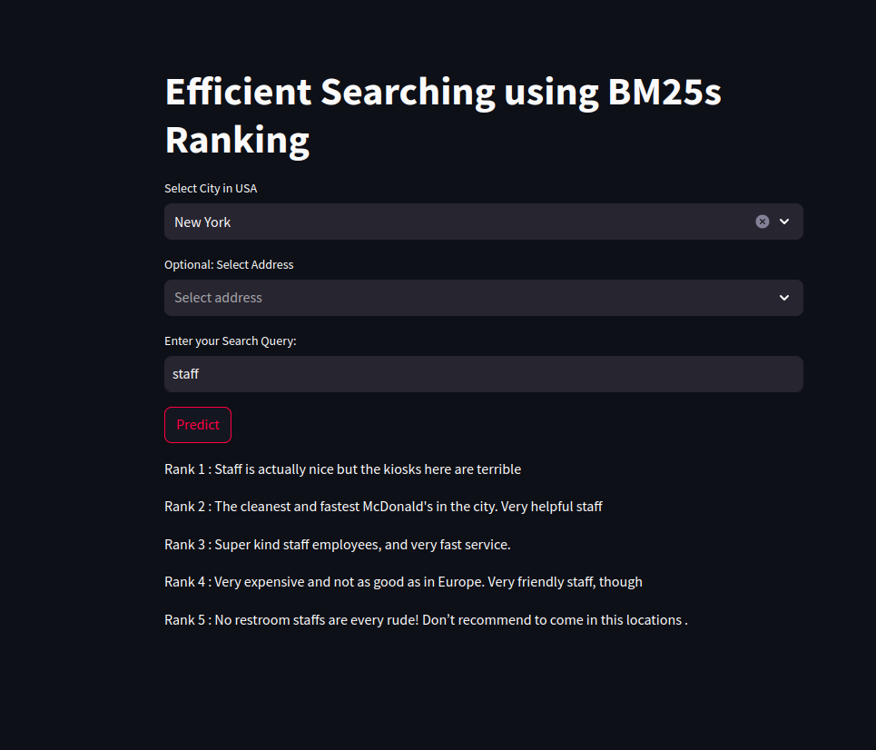
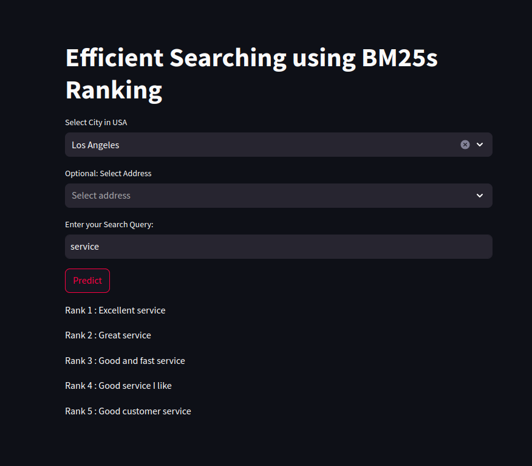
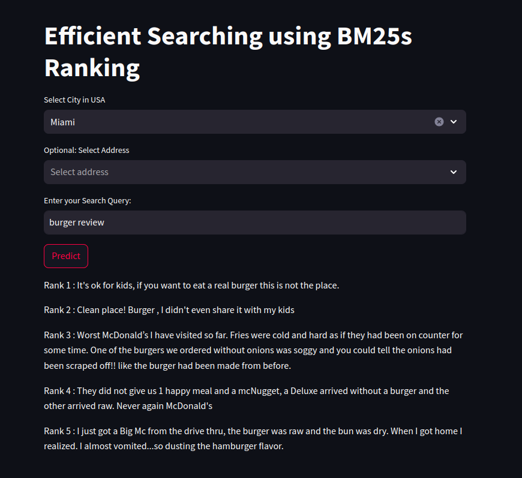

# Efficient-Searching-using-BM25s-Ranking
Build a Streamlit App to create a search engine for McDonald's reviews.

## Installation
```pip install -q bm25s pandas streamlit PyStemmer```

## Run App:
```streamlit run app.py```

# Result:



